> B.Tech Computer Science Engineering student at Amrita Vishwa Vidyapeetham. 
> I build things end-to-end — from mobile apps to the dashboards that monitor them.

I like understanding systems down to the protocol level, not just the framework level. 
Currently deep in a self-directed 90 Days of CS track — networking internals, systems programming in Rust, and purple-team security. 
Also a Security Researcher with Init Club.

 

 

 

Every graphic here is generated entirely on this repository, not embedded from anyone else's server. 
The portrait is a photo pushed through a character ramp; the stat graphics and these section headings are drawn by a scheduled action straight from the GitHub GraphQL API, committing only what changed.

They animate with SMIL inside the SVG, meaning nothing loads from a third party, and nothing here can rate-limit or go dark. 
The typeface is JetBrains Mono, subset to just the characters each graphic draws and inlined as base64 to ensure pixel-perfect rendering across all devices.
